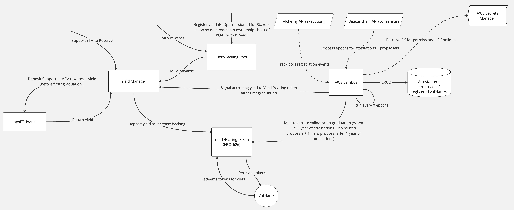

# Stakers Union – Boost Pool & Yield Management System

This repository implements a **Boost Pool** and associated **Yield Management** flow for ETH validators. By leveraging
POAP ownership, MEV rewards, and yield‐bearing vaults, validators can join the Stakers Union to compound their staking
rewards and graduate after a specified duration.

---

## Overview

1. **Stakers Union POAP**

   - A POAP (Proof of Attendance Protocol) token identifies eligible stakers.
   - Each validator must own this POAP to register in the Boost Pool.

2. **Boost Pool**

   - Orchestrates validator registration, tracks attestation performance, and triggers “graduation” for validators who
     meet the required conditions.
   - Also allows depositors to set a custom reward recipient.

3. **Yield Manager**

   - Collects ETH from MEV rewards or direct deposits.
   - Converts ETH to ApxETH and deposits it into a yield‐bearing vault (e.g., `ApxETHVault`).
   - Periodically “distributes yield” by topping up the PerpYieldBearingAutoPxEth contract.

4. **ApxETHVault**

   - A drip vault that accepts ETH (converted into ApxETH) and invests it via PirexEth for yield.
   - Allows claiming of accrued yield once the yield flow is activated.

5. **PerpYieldBearingAutoPxEth** (ERC4626 Vault)

   - A perpetual, auto‐compounding vault that holds pxETH or a derivative, distributing yield over time to stakers.
   - Shares can be minted on “graduation” to validators based on attestation points.

6. **Validator**
   - Registers with the Boost Pool using the Stakers Union POAP.
   - After a set block duration (e.g., 180 days), the validator can “graduate” and receive yield‐bearing shares.

---

## High-Level Flow

1. **POAP Requirement**

   - A staker obtains a Stakers Union POAP (e.g., ID 175498).
   - The staker calls `subscribeValidator` on the **Boost Pool**, passing `_validatorId` and the `_poapId`.

2. **MEV Rewards / Donations**

   - ETH flows into the **Yield Manager** (either as MEV rewards or direct deposits).
   - The manager calls `depositFunds()`, which sends ETH to the `ApxETHVault`.

3. **ApxETHVault Deposit**

   - On deposit, the vault interacts with PirexEth, converting ETH to ApxETH.
   - The vault tracks the total deposit and can handle fees.

4. **Yield Manager – Distribute Yield**

   - The manager calls `distributeYield()`, which claims ApxETH from the vault and tops up the
     **PerpYieldBearingAutoPxEth** contract, boosting its share balance.

5. **Validator Graduation**

   - After the validator’s lock period (e.g., 180 days), the **Boost Pool** triggers `graduateValidator`.
   - The pool calls `distributeShares` on the **PerpYieldBearingAutoPxEth**, minting yield‐bearing shares to the
     validator’s address.

6. **Withdrawal**
   - If a user deposited ETH through the **Yield Manager** (and not via the staker’s internal deposit), they can
     retrieve their share after the lock period.

---

## Diagram

Below is a simplified representation of the system architecture (as seen in the accompanying diagram):

---

## Key Contracts

- **`BoostPool`**:  
  Handles validator registration, POAP checks, setting reward recipients, and calls to “graduate” validators.

- **`YieldManager`**:  
  Receives ETH (MEV or user deposits), deposits into `ApxETHVault`, and periodically calls `distributeYield()` to top up
  the `PerpYieldBearingAutoPxEth`.

- **`ApxETHVault`** (drip vault):  
  Accepts ETH, converts it to ApxETH via PirexEth, and tracks total deposits. Allows yield claiming once the yield flow
  is activated.

- **`PerpYieldBearingAutoPxEth`** (ERC4626):  
  A yield‐bearing vault that mints shares to validators upon graduation, representing their portion of the
  auto‐compounding staking rewards.

---

## Project Structure

- **Interfaces** (`IYieldManager`, `IBoostPool`, `IApxETHVault`, `IDripVault`, etc.)  
  Each contract has a corresponding interface with function signatures, errors, and events.

- **Contracts**

  - `BoostPool.sol`: The main entry point for validator registration and graduation.
  - `YieldManager.sol`: Gathers ETH, deposits into the vault, and triggers yield distribution.
  - `ApxETHVault.sol`: A specialized drip vault for ApxETH, hooking into PirexEth.
  - `PerpYieldBearingAutoPxEth.sol`: An ERC4626 vault that manages minted shares for yield accrual.

- **Base Classes**
  - `BaseDripVault.sol`: Abstract contract that implements core deposit/withdraw logic.
  - `AccessControl`, `Ownable`, `ReentrancyGuard`: OpenZeppelin modules for roles and security.

---

## Usage Flow (Summary)

1. **Admin Setup**

   - Deploy and configure each contract (Vault, Yield Manager, Boost Pool, etc.).
   - Assign roles: `ADMIN_ROLE`, `AUTOMATOR_ROLE`, etc.

2. **Validator Subscribes**

   - Must hold a valid POAP (Stakers Union event).
   - Calls `subscribeValidator` on `BoostPool`.

3. **Yield Flow**

   - MEV rewards or direct deposits flow to `YieldManager`.
   - Manager calls `depositFunds()`, which goes to `ApxETHVault`.
   - Manager can call `distributeYield()` to top up `PerpYieldBearingAutoPxEth`.

4. **Validator Graduation**
   - After enough blocks (GRADUATION_DURATION_IN_BLOCKS), the automator calls `graduateValidator`.
   - The pool mints yield shares to the validator.
   - The validator can redeem or hold these yield‐bearing shares.

---

## License

All code in this repository is licensed under the [MIT License](LICENSE).

---

## Contributing

1. Fork the repository.
2. Create a feature branch.
3. Open a pull request with a clear description of changes.

---

## Contact

For questions or suggestions, please reach out via issues or open a discussion. We welcome contributions and feedback
from the community!
