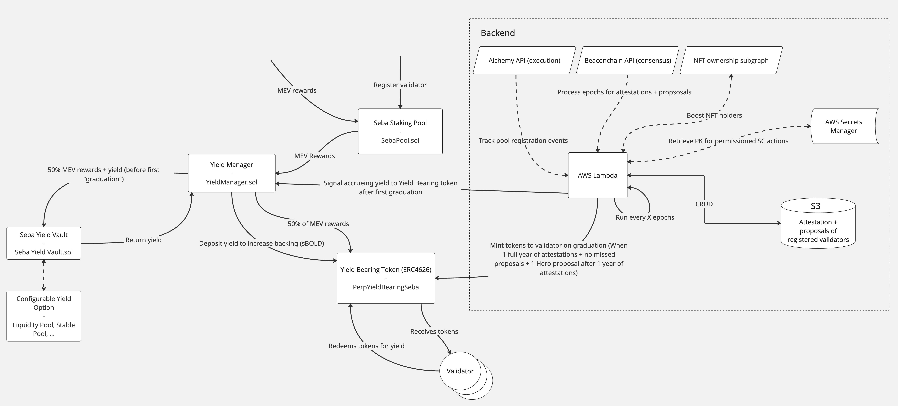

# Seba – Perpetual Yield for Ethereum Solo Validators

Seba is a protocol enabling **solo Ethereum validators** to unlock **perpetual yield** from their execution rewards. By
committing their rewards for a fixed period, validators can graduate and receive yield-bearing shares that continue to
generate rewards indefinitely.

The system builds on **Heroglyphs** and the **DappNode Smoothing Pool** design, but introduces **NFT-boosted rewards**,
perpetual yield mechanics, and a decentralized validator alignment model.

---

## Overview

1. **Validator Registration (Seba Pool)**

   - Solo validators register their validator ID in the **SebaPool** contract.
   - They must set their validator **fee recipient** address to the SebaPool for the entire commitment period (typically
     6 months).
   - Failing to maintain this commitment resets their graduation period.

2. **Commitment Period**

   - While committed, **50% of MEV/execution rewards** are sent to the **Seba Yield Vault** as principal for yield
     generation.
   - The other **50% is converted to sBOLD** and distributed via the **Perpetual Yield Bearing Seba Vault (pybSeba)**.

3. **Graduation**

   - After the commitment period, validators become eligible to graduate.
   - Graduation requires inclusion of their validator ID as a ticker in a valid **Heroglyphs block**.
   - On graduation, validators receive **pybSeba shares**, proportional to their staked ETH, attestation performance,
     and potential **NFT boosts**.

4. **Perpetual Yield**

   - pybSeba shares entitle holders to perpetual yield in sBOLD, sourced from the Seba Yield Vault.
   - Shares can be **burned for immediate rewards** or **held for ongoing yield**.

5. **Boosts**
   - **Stakers Union POAP holders** and **Heroglyphs Kamisama NFT holders** receive a **2.5x reward boost**.
   - Boost eligibility is continuously checked each epoch.

---

## High-Level Flow

1. **Opt-in:** Validator registers ID in SebaPool and points fee recipient to Seba.
2. **Commit:** Validator accrues attestation points during the 6-month period while rewards are split 50/50.
3. **Backend Sweep:** Every ~5 epochs, rewards are swept into the Seba Yield Vault and pybSeba vault.
4. **Graduation:** Validator graduates by being included in a valid Heroglyphs block.
5. **Receive Shares:** Validator’s withdrawal address (or configured recipient) receives pybSeba shares.
6. **Redeem/Compound:** Validator can burn shares for sBOLD or keep them to accrue perpetual yield.

---

## Key Contracts

- **`SebaPool`**  
  Handles validator registration, graduation eligibility, reward recipient configuration, and boosts.

- **`SebaYieldVault`**  
  Collects 50% of MEV rewards, converts them into yield-bearing assets, and locks them as protocol principal.

- **`pybSeba` (Perpetual Yield Bearing Seba Vault)**  
  ERC4626 vault that distributes perpetual yield (sBOLD) to graduated validators holding shares.

- **Backend Services**
  - Sweep rewards every ~5 epochs into vaults.
  - Track validator state (attestations, proposals, graduation eligibility).
  - Use **Alchemy + Beaconcha.in APIs**, custom Subgraph, and AWS Lambda/Secrets Manager.

---

## Architecture

## Boosts & Alignment

Aligned communities benefit from higher rewards:

- **Stakers Union POAP** (checked on Ethereum Mainnet and Gnosis Chain).
- **Heroglyphs Kamisama NFT** (must be continuously held).
- Boost: **2.5x shares multiplier**.

This ensures that aligned validators are strongly incentivized to join Seba.

---

## Simulation Results

Monte Carlo simulations (1000 iterations, 1000 validators) demonstrate:

- **50/50 split model** (half rewards to principal, half directly distributed) provides strong yield performance.
- **Boosted validators** (x2.5) significantly outperform, making aligned participation highly rewarding.
- Even in a **worst-case scenario** (no new validators after 2 years), yield remains perpetual and attractive.

---

## Project Structure

- **Contracts**

  - `SebaPool.sol`
  - `EUSDUSDCBeefyYieldVault.sol`
  - `PYBSeba.sol`
  - `EthToBoldRouter.sol`
  - `YieldManager.sol`

- **Interfaces**

  - `ISebaPool`
  - `IEUSDUSDCBeefyYieldVault`
  - `IYieldVault`
  - `IPybSebaVault`
  - `IEthToBoldRouter`
  - `IYieldManager`

- **Backend**
  - Reward sweeping (cron jobs every 5 epochs).
  - Validator state tracking API:  
    `https://ddflzdhahq8jq.cloudfront.net/validator-stats/?validators=...`

---

## Usage Flow (Summary)

1. **Validator Onboarding**

   - Register validator ID in SebaPool.
   - Set fee recipient to SebaPool.

2. **Commitment Period**

   - Rewards are swept 50/50 between principal and sBOLD.
   - Validator accrues attestation points.

3. **Graduation**

   - After 6 months, validator ID must be included in a Heroglyphs block.
   - Validator receives pybSeba shares.

4. **Yield Redemption**
   - Burn shares for sBOLD (immediate yield).
   - Or hold shares for perpetual compounding rewards.

---

## Audits

0xRiptide bot: https://gist.github.com/0xriptide/d7994a953b86b90ff3a1f8703e20b77c 

0xZarf: [zarf.md](audits/zarf.md)

Fixes for audits: https://github.com/Archethect/hero_boost/pull/1

## License

All code in this repository is licensed under the [MIT License](LICENSE).

---

## Contributing

1. Fork the repository.
2. Create a feature branch.
3. Open a pull request with a clear description of changes.

---

## Contact

Questions or ideas?  
Open an issue or start a discussion — we welcome contributions from the validator community!
